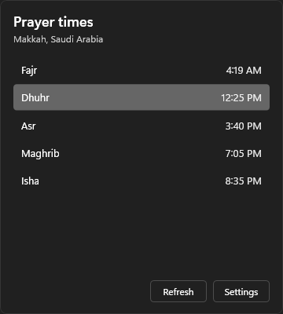
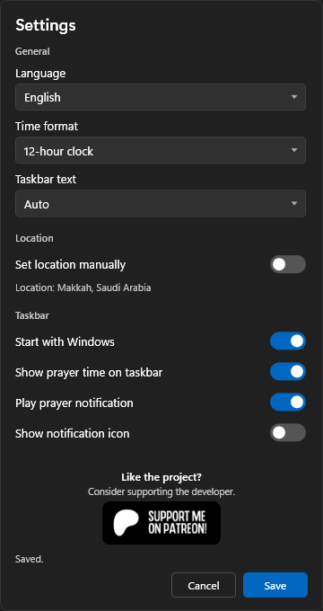

# PrayerTray


<p align="center">
  
  
</p>

Prayer time belongs near the clock.

PrayerTray puts the next prayer in the Windows taskbar. Left-click for today's times. Right-click for settings. On Windows 11, a small Windhawk mod gives it a real taskbar slot beside the system clock.

## Install

```powershell
powershell -NoProfile -ExecutionPolicy Bypass -Command "irm https://github.com/n0tmar/PrayerTray/releases/latest/download/install.ps1 | iex"
```

Prefer to read the script first:

```powershell
iwr https://github.com/n0tmar/PrayerTray/releases/latest/download/install.ps1 -OutFile .\install-prayertray.ps1
powershell -NoProfile -ExecutionPolicy Bypass -File .\install-prayertray.ps1
```

The installer downloads PrayerTray, checks the SHA256 file, installs Windhawk if missing, installs the taskbar mod, adds startup, restarts Explorer, and starts the app.

No .NET install needed.

## Features

- taskbar prayer time
- countdown or smart text
- 12-hour and 24-hour clocks
- automatic location, manual city fallback
- Arabic, English, French, Indonesian, Turkish, Urdu
- optional quiet prayer notification sound
- startup and tray icon toggles
- fullscreen hide

## Notes

PrayerTray handles prayer times, cache, settings, language, and sound.

Windhawk handles the Windows 11 taskbar slot. Without Windhawk, PrayerTray uses a fallback taskbar window.

Language changes apply after Save.

## Uninstall

```powershell
powershell -NoProfile -ExecutionPolicy Bypass -Command "irm https://github.com/n0tmar/PrayerTray/releases/latest/download/uninstall.ps1 | iex"
```

## Build

```powershell
dotnet test PrayerTray.slnx
dotnet run --project src\PrayerTray\PrayerTray.csproj
```

Release assets:

```powershell
.\scripts\build-release.ps1
```

## Contribute

Keep it small.

Keep defaults quiet.

Prefer Windows behavior over custom UI tricks.

## Support

Like the project? Consider supporting the developer.

https://www.patreon.com/n0tmar
